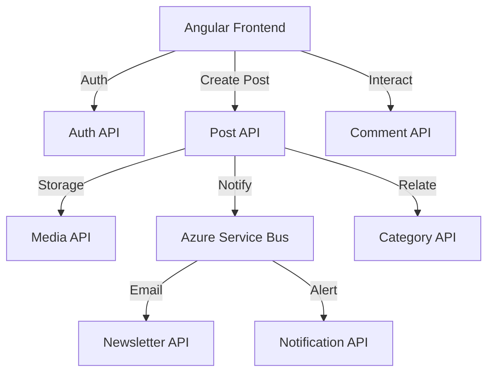

# 🖋️ InkWell

InkWell is a modern, scalable, and microservices-based content management and blogging platform. Built with a focus on performance, security, and cloud-native architecture, it leverages the power of .NET 8 and Azure to provide a robust backend for high-traffic applications.

---

## 🌐 Live API Documentation

Explore the live Swagger documentation for each microservice:

| Service | Swagger UI Link |
| :--- | :--- |
| **Auth API** | [https://inkwell-auth-api.azurewebsites.net](https://inkwell-auth-api.azurewebsites.net) |
| **Post API** | [https://inkwell-post-api.azurewebsites.net/swagger](https://inkwell-post-api.azurewebsites.net/swagger) |
| **Category API** | [https://inkwell-category-api.azurewebsites.net/swagger](https://inkwell-category-api.azurewebsites.net/swagger) |
| **Comment API** | [https://inkwell-comment-api.azurewebsites.net/swagger](https://inkwell-comment-api.azurewebsites.net/swagger) |
| **Media API** | [https://inkwell-media-api.azurewebsites.net/swagger](https://inkwell-media-api.azurewebsites.net/swagger) |
| **Newsletter API** | [https://inkwell-newsletter-api.azurewebsites.net/swagger](https://inkwell-newsletter-api.azurewebsites.net/swagger) |
| **Notification API** | [https://inkwell-notification-api.azurewebsites.net/swagger](https://inkwell-notification-api.azurewebsites.net/swagger) |

---

## 🏗️ Microservices Architecture

InkWell is decoupled into several focused microservices, ensuring independent scalability and maintenance:

| Service | Responsibility | Key Features |
| :--- | :--- | :--- |
| **Auth API** | Identity & Access | JWT, Role-based Access, Refresh Tokens. |
| **Post API** | Content Management | Slug generation, Read-time calculation, View tracking. |
| **Category API** | Taxonomy | Hierarchical categories, Content tagging. |
| **Comment API** | Interactions | Threaded comments, Real-time engagement. |
| **Media API** | Asset Management | Azure Blob Storage integration, Image optimization. |
| **Newsletter API** | Subscriptions | Mailing list management, Automated campaigns. |
| **Notification API** | System Alerts | Cross-service event notifications, User alerts. |
| **Shared** | Core Kernel | BaseEntity, Repository Pattern, Shared DTOs. |

### 🔄 Service Interaction Flow



---

## 🚀 Tech Stack

### Backend & Database
- **Framework:** .NET 8 (C#)
- **Database:** Azure SQL (Entity Framework Core)
- **Caching:** In-memory / Distributed Cache (Azure Redis ready)
- **Messaging:** Azure Service Bus (Topics & Subscriptions)

### Security & DevOps
- **Identity:** Managed Identity (System-Assigned)
- **Secrets:** Azure Key Vault (Dynamic Secret Injection)
- **Cloud:** Azure App Service, Azure Storage Accounts
- **Monitoring:** Azure Application Insights & Log Analytics
- **CI/CD:** Azure DevOps / GitHub Actions compatible

---

## 🛠️ Getting Started

### Prerequisites

- [.NET 8 SDK](https://dotnet.microsoft.com/download/dotnet/8.0)
- [Azure CLI](https://docs.microsoft.com/en-us/cli/azure/install-azure-cli)
- [Azurite](https://github.com/Azure/Azurite) (For local storage emulation)
- [SQL Server](https://www.microsoft.com/en-us/sql-server/sql-server-downloads) (Local or Azure)

### Local Development

1. **Clone the repository:**
   ```bash
   git clone https://github.com/prakharsrivasofficial15/InkWell.git
   cd InkWell
   ```

2. **Restore Dependencies:**
   ```bash
   dotnet restore
   ```

3. **Database Migrations:**
   Each service manages its own schema. To apply migrations locally:
   ```bash
   cd InkWellPost.API
   dotnet ef database update
   ```

4. **Environment Setup:**
   - Ensure **Azurite** is running for Media API.
   - Configure connection strings in `appsettings.Development.json`.
   - Use `dotnet user-secrets set` for sensitive local keys.

---

## 📂 Project Structure

```text
InkWell/
├── InkWell.Shared/           # Shared Kernel (DTOs, BaseEntity, IBaseRepository)
├── InkWellAuth.API/          # Identity (Registration, Login, Refresh Tokens)
├── InkWellPost.API/          # Content (Posts, Views, ReadTime, Slugs)
├── InkWellCategory.API/      # Organization (Categories, Tags)
├── InkWellComment.API/       # Interaction (Comments, Likes)
├── InkWellMedia.API/         # Assets (Uploads, Blob Storage)
├── InkWellNewsletter.API/    # Marketing (Mailing Lists, Templates)
├── InkWellNotification.API/  # System (Alerts, Event Consumers)
├── publish/                  # Build artifacts (ignored by git)
├── deploy.ps1                # Azure Deployment Automation
└── InkWell.slnx              # Solution Configuration (Modern XML)
```

---

## 🛡️ Security & Architecture Patterns

### 1. Key Vault Secret Injection
Instead of storing secrets in `appsettings.json`, InkWell uses the **Azure Key Vault Provider**. At startup, the app connects to the vault via **Managed Identity** and injects secrets directly into the `IConfiguration` pipeline.

### 2. The Shared Kernel (`InkWell.Shared`)
- **`BaseEntity`**: Implements `Id (Guid)`, `CreatedAt (UTC)`, `UpdatedAt`, and **Soft Delete** (`IsDeleted`).
- **Repository Pattern**: Standardizes database access across all microservices.

### 3. Asynchronous Workflows
High-latency tasks (like sending emails or processing notifications) are offloaded to **Azure Service Bus**. This ensures the primary APIs remain responsive.

---

## 📦 Deployment

Deploying the entire ecosystem is automated via `deploy.ps1`.

### Command Syntax:
```powershell
./deploy.ps1 -ResourceGroup "inkwell-rg" -KeyVaultName "inkwell-kv" -Location "centralindia"
```

**What the script does:**
1. Provisions the **App Service Plan** (B1 SKU).
2. Creates **7 Web Apps** with .NET 8 runtimes.
3. Configures **System-Assigned Managed Identity** for every app.
4. Grants **RBAC permissions** to the Key Vault.
5. Builds, Zips, and Deploys each service via **ZipDeploy**.

---

## 📈 Monitoring & Observability

- **Application Insights**: Integrated into every service for distributed tracing.
- **Health Checks**: Standard ASP.NET Health Check endpoints are available for Azure Traffic Manager/Front Door integration.
- **Structured Logging**: Logs are streamed to Azure Log Analytics for centralized querying.

---

## 📄 License

This project is licensed under the MIT License - see the LICENSE file for details.
